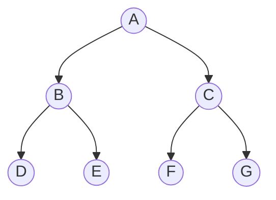

<h1 align="center">二叉树</h1>

## 什么是二叉树
> 二叉树是一种树形结构，一般的树也能简单地转换成二叉树从而可以对该树进行运算和遍历，达到化繁为简的程度

之所有被称为二叉树，是因为其所有结点都只能有`0~2`个子结点，他们分别为`左`子结点和`右`子结点


## 二叉树的性质 :sparkles:
```
                层级     最多结点数
       A         1        1
     /   \        
    B     C      2        2
   / \   / \  
  D   E F   G    3        4

      ...        K      2^(k-1)
```
性质 1. 在二叉树的第i层上最多有 2<sup>i-1</sup> 个结点(i >= 1)


以下是解释：
当层级为1时，最多有 1 个结点
当层级为2时，最多有 2 个结点
当层级为3时，最多有 4 个结点
当层级为K时，最多有 2<sup>K-1</sup>个结点

性质 2. 深度为k的二叉树最多有 2<sup>k</sup>-1 个结点(k >= 1)

以下是解释：

$$Sn = 2^0 + 2^1 + 2^2 + ... + 2^{k-1} = \sum_{i=1}^{k} 2^{i-1} = 2^{k}-1$$

不知道上面的公式怎么来的吗？

等比数列，数学不好的看看推导吧。。。其实我也不会忘了已经，问别人才知道

$$Sn = 2^0 + 2^1 + 2^2 + ... + 2^{k-1}$$

$$2*Sn = 2^1 + 2^2 + ... + 2^{k-1} + 2^k$$

$$2*Sn - Sn = 2^k - 2^0 $$

$$(2-1)*Sn = 2^k - 2^0$$

$$Sn =  \frac{2^k - 2^0}{2-1}$$

$$Sn = 2^k - 1$$

性质 3. 对任何一颗二叉树 T ，若其叶子结点数时 n<sub>0</sub> ，度为结点数为 n<sub>2</sub>，则  n<sub>0</sub> = n<sub>2</sub> + 1


性质 4. 具有 n 个结点的 [^完全二叉树] 的深度为 log n + 1 (log n 向下取整) 或 log(n+1) (log(n+1)向上取整)

## 二叉树的存储结构

1. 顺序存储
  
    从上到下从左到右列编号，然后存储在一个一维数组bt里面<br/>
    虽然操作简单但是浪费存储空间


2. 链式存储

    每个结点设置三个或四个域<br/>
    三个域：`lchild`, `data`, `rchild`<br/>
    四个域：`lchild`, `data`, `parent`, `rchild`<br/>

    `lchild`表示：该结点的左子树
    
    `data`&nbsp;&nbsp;&nbsp;&nbsp;&nbsp;表示：该结点的数据
    
    `parent`表示：该结点的父节点

    `rchild`表示：该结点的右子树
    
## 二叉树的生成
    通过广义表来生成二叉树
    通过完全二叉树的顺序依次输入结点信息来生成二叉树
## 二叉树的遍历 :sparkles:
1. 递归
    * 前序遍历：根-左-右
      算法：
      ```C++
      void preOrder(BiTree T)
      {
          if(T != NULL)
          {
              printf("%c", T->data);
              preOrder(T->lchild);
              preOrder(T->rchild);
          }
      }
      ```
    * 中序遍历：左-根-右
      算法：
      ```C++
      void inOrder(BiTree T)
      {
          if(T != NULL)
          {
              inOrder(T->lchild);
              printf("%c", T->data);
              inOrder(T->rchild);
          }
      }
      ```
    * 后序遍历：左-右-根
      算法：
      ```C++
      void postOrder(BiTree T)
      {
          if(T != NULL)
          {
              postOrder(T->lchild);
              postOrder(T->rchild);
              printf("%c", T->data);
          }
      }
      ```
2. 非递归
    * 栈的非递归中序遍历
      算法：
      ```C++
      void inOrder(BinTree bt)
      {
          SeqStack S;
          BinTNode *p;
          InitStack(S);
          Push(&S, bt);
          while(!StackEmpty(S)){
            while(GetTop(&S)){
              Push(&S, GetTop(&S)->lchild);
            }
            p = Pop(&S);
            if(!StackEmpty(S)){
              printf("%c", GetTop(&S)->data);
              p = Pop(&S);
              Push(&S, p->rchild);
            }
          }
      }
      ```
    * 通过指针数组来实现中序遍历
      算法：
      ```C++
      void inOrder(BinTree bt){
        int top = 0;
        BinTNode *stack[MAXSIZE];
        stack[top] = bt;
        do{
          while(stack[top] != NULL){  // 根结点及其所有的左结点进入数组，其中根结点排在数组的第一个位置
            top = top + 1;
            stack[top] = stack[top-1]->lchild; // 结点的左子树进入数组
          }
          // 全部左子树进入数组后，最底层的左结点送出数组，并输出结点的值
          top = top - 1;
          if(top >= 0){
            printf("%c", stack[top]->data); // 左结点和根结点都输出完了
            stack[top] = stack[top]->rchild; // 右结点进入数组 
          }
        }while(top != 0); // 索引已经小于0，说明已经遍历完了
      }
      ```
## 二叉树的应用举例
## 线索二叉树
## 二叉树的线索化 -> 线索二叉树
## 二叉线索链表的相关运算

[^完全二叉树]: k-1层是满二叉树，第k层的结点都集中在最左侧
