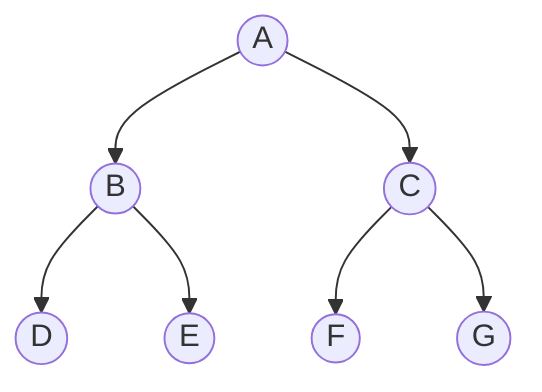

<h1 align="center">二叉树</h1>

## 什么是二叉树
> 二叉树是一种树形结构，一般的树也能简单地转换成二叉树从而可以对该树进行运算和遍历，达到化繁为简的程度

之所有被称为二叉树，是因为其所有结点都只能有`0~2`个子结点，他们分别为`左`子结点和`右`子结点

## 二叉树的性质 :sparkles:
性质 1. 在二叉树的第i层上最多有 2i-1 个结点(i >= 1)

性质 2. 深度为k的二叉树最多有 2k-1 个结点(k >= 1)

性质 3. 对任何一颗二叉树 T ，若其叶子结点数时 n0 ，度为结点数为 n2，则  n0 = n2 + 1

性质 4. 具有 n 个结点的 [^完全二叉树] 的深度为 log n + 1 (log n 向下取整) 或 log(n+1) (log(n+1)向上取整)

## 二叉树的存储结构
## 二叉树的生成
## 二叉树的遍历 :sparkles:
## 二叉树的应用举例
## 线索二叉树
## 二叉树的线索化 -> 线索二叉树
## 二叉线索链表的相关运算

[^完全二叉树]: k-1层是满二叉树，第k层的结点都集中在最左侧
